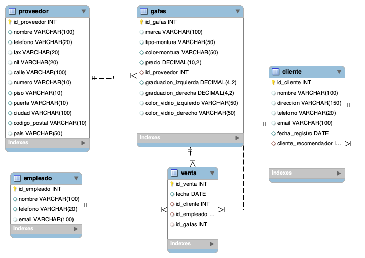

# Base de datos - Óptica Cul d'Ampolla

Proyecto de modelado de base de datos SQL para la gestión de una óptica.

## Descripción

Este proyecto implementa el diseño de una base de datos relacional para una óptica llamada **Cul d'Ampolla**.  
La base de datos permite gestionar:

- Proveedores de gafas
- Marcas
- Modelos de gafas
- Clientes
- Empleados
- Ventas
- Detalle de cada venta

También incluye consultas para verificar que el modelo funciona correctamente.

---

## Estructura del repositorio

```
mysql-estructura
│
├── optica.sql
├── optica_data.sql
├── optica_queries.sql
├── optica_diagram.png
└── optica_diagram.mwb
```

### Archivos

**optica.sql**  
Script de creación de la base de datos y de todas las tablas.

**optica_data.sql**  
Datos de prueba utilizados para comprobar el funcionamiento del modelo.

**optica_queries.sql**  
Consultas SQL solicitadas en el ejercicio para verificar el diseño de la base de datos.

**optica_diagram.png**  
Diagrama entidad-relación (modelo relacional) de la base de datos.

**optica_diagram.mwb**  
Archivo del modelo EER de MySQL Workbench que permite modificar o regenerar el diagrama.

---

## Orden de ejecución

Para recrear completamente la base de datos:

1. Ejecutar `optica.sql`
2. Ejecutar `optica_data.sql`
3. Ejecutar `optica_queries.sql`

---

## Autor

David  
03/2026

---

## Diagrama de la base de datos


