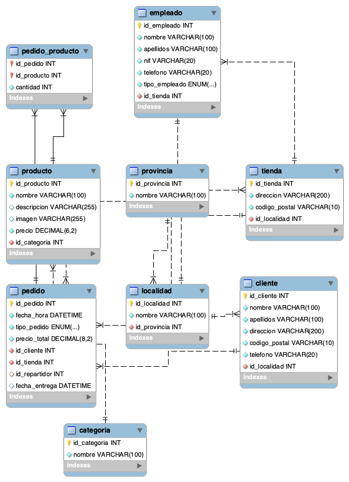

# Base de datos - Pizzería

Proyecto de modelado de base de datos SQL para una web que permite realizar pedidos de comida a domicilio o para recoger en tienda.

El objetivo del proyecto es diseñar la estructura de una base de datos relacional que permita gestionar clientes, productos, pedidos, tiendas y empleados de una pizzería.

---

## Descripción del modelo

La base de datos permite gestionar:

- Provincias y localidades
- Clientes
- Tiendas
- Empleados (cocinero o repartidor)
- Productos
- Categorías de productos
- Pedidos
- Productos incluidos en cada pedido

Cada pedido pertenece a un cliente y es gestionado por una tienda.  
Los pedidos pueden contener uno o varios productos y, en el caso de entrega a domicilio, se guarda qué repartidor realiza la entrega y la fecha de entrega.

---

## Estructura del repositorio

```
pizzeria
│
├── pizzeria_schema.sql
├── pizzeria_data.sql
├── pizzeria_queries.sql
├── pizzeria_diagram.png
└── pizzeria_diagram.mwb
```

### Archivos

**pizzeria_schema.sql**  
Script de creación de la base de datos y de todas las tablas.

**pizzeria_data.sql**  
Datos de prueba utilizados para verificar el funcionamiento de la base de datos.

**pizzeria_queries.sql**  
Consultas SQL solicitadas en el ejercicio para comprobar que el modelo funciona correctamente.

**pizzeria_diagram.png**  
Diagrama entidad-relación de la base de datos.

**pizzeria_diagram.mwb**  
Archivo del modelo EER de MySQL Workbench que permite modificar el diagrama.

---

## Orden de ejecución

Para recrear completamente la base de datos:

1. Ejecutar `pizzeria_schema.sql`
2. Ejecutar `pizzeria_data.sql`
3. Ejecutar `pizzeria_queries.sql`

---

## Consultas realizadas

Las consultas incluidas en el ejercicio permiten:

- Saber cuántos productos de categoría **Begudes** se han vendido en una determinada localidad.
- Saber cuántos pedidos ha realizado un determinado empleado (repartidor).

---

## Autor

David  
03/2026

---

## Diagrama de la base de datos


