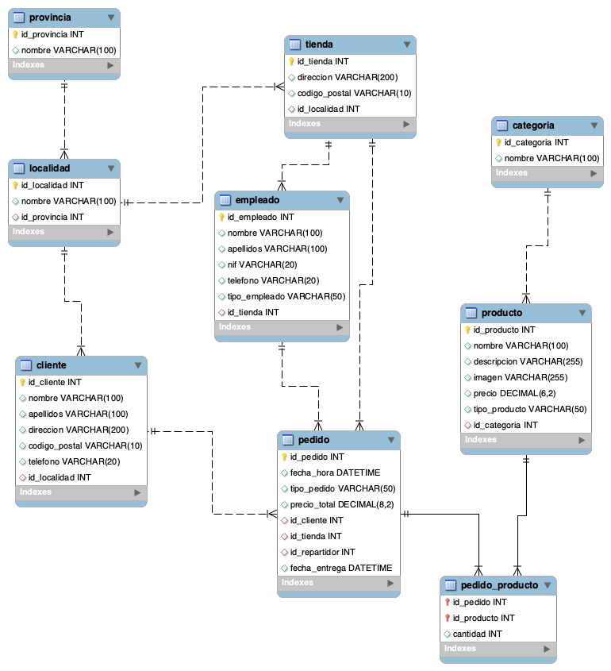

# Ejercicio 2 – Pizzería

Modelo de base de datos para una web de pedidos de comida a domicilio.

Incluye:

- Provincias y localidades
- Clientes
- Tiendas
- Empleados
- Productos
- Categorías
- Pedidos
- Relación entre pedidos y productos

Archivos:

- pizzeria_model.png → Diagrama entidad-relación
- pizzeria.sql → Script SQL de creación de la base de datos
- 
## Diagrama

